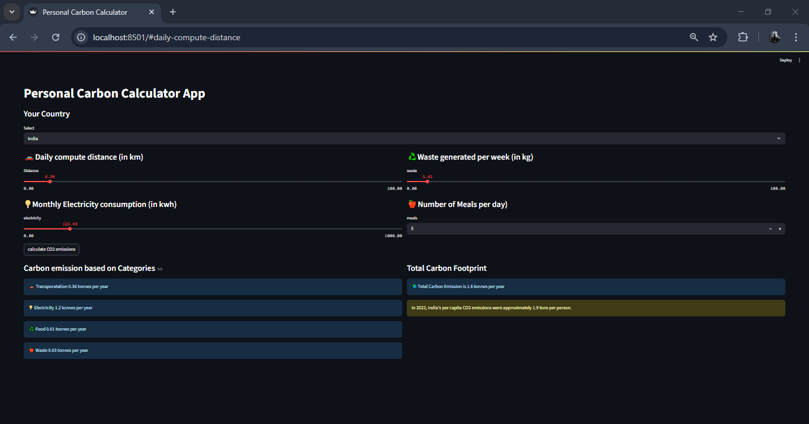

# 🌱 Personal Carbon Footprint Calculator

A simple and interactive web application built using **Streamlit** to estimate your annual **carbon footprint** based on your daily lifestyle. Understand how your transportation, electricity usage, diet, and waste generation contribute to your carbon emissions.

---

## 🚀 Features

- 🌍 Country selection (currently supports **India**)
- 🚗 Daily commute distance input
- 💡 Monthly electricity usage input
- ♻️ Weekly waste generation input
- 🍎 Number of meals per day input
- 📊 Category-wise carbon emission breakdown
- 🌏 Total annual carbon footprint summary
- 📉 Comparison with national average (India)

---
## Output



## 🧮 Emission Factors (India)

| Category        | Emission Factor (kg CO₂e per unit) |
|----------------|-------------------------------------|
| Transportation | 0.14 per km                         |
| Electricity    | 0.82 per kWh                        |
| Diet           | 1.25 per meal                       |
| Waste          | 0.10 per kg                         |

> All outputs are converted to **tonnes/year**

---

## 🧑‍💻 How to Run

## Create virtual environment
```
python -m venv myenv
```
```
myenv\Scripts\activate.bat
```
## Run the Streamlit app:
```
streamlit run app.py
```
